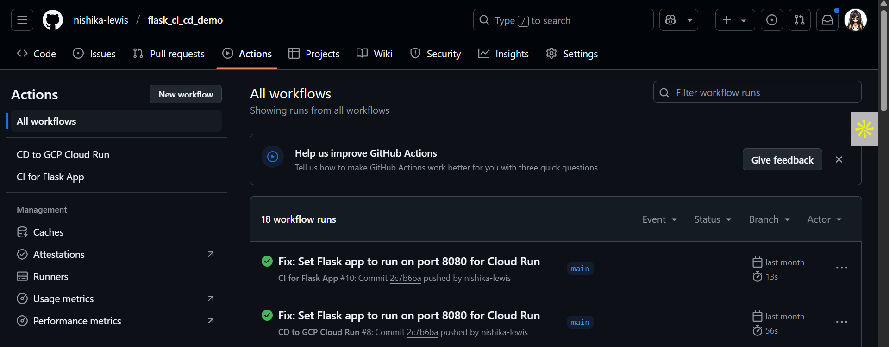

# 🚀 Flask CI/CD Deployment Demo

This project demonstrates how to deploy a simple Flask application using a complete CI/CD pipeline with **GitHub Actions** and **Google Cloud Run**.

The goal of this project was not the complexity of the app, but rather understanding how to connect development to production in a clean, automated workflow.

---

## ⚙️ Technologies Used

- Python (Flask)
- GitHub Actions (CI/CD)
- Google Cloud Platform (Cloud Run, Secret Manager)
- Docker
- YAML

---
## 🌐 Live Demo

🔗 [Visit the App](https://flask-ci-cd-service-51907083957.us-central1.run.app)

---

## 📸 Screenshot



---
## 🧠 What I Learned

Through this project, I learned:

- How to use GitHub Actions for Continuous Integration and Continuous Deployment
- Setting up and connecting **Google Cloud Run**
- Creating and managing **service account credentials** via **GCP Secret Manager**
- Writing and understanding CI/CD YAML configuration files
- Triggering automatic deployments on every push to `main`

---

## 🛠️ CI/CD Pipeline Steps

Here’s the step-by-step pipeline I implemented:

1. ✅ **Create a Flask app** (`app.py`)
2. ✅ **Create a Dockerfile** to containerize the app
3. ✅ **Create a `main.yml` file** under `.github/workflows` for GitHub Actions
4. ✅ **Enable Google Cloud APIs** (Cloud Run, IAM, Secret Manager, Artifact Registry)
5. ✅ **Create a service account** and assign required permissions
6. ✅ **Generate a JSON key** for the service account
7. ✅ **Add the key as a GitHub Secret** named `GCP_SA_KEY`
8. ✅ **Set project ID, region, service name** as secrets in GitHub
9. ✅ **Push to GitHub** and trigger the workflow
10. ✅ **Watch the GitHub Actions pipeline build and deploy**
11. ✅ **App goes live on Cloud Run! 🎉**

---

## 📝 Example CI/CD YAML Highlights

```yaml
name: CI/CD to GCP

on:
  push:
    branches: [main]

jobs:
  deploy:
    runs-on: ubuntu-latest
    steps:
      - uses: actions/checkout@v3
      - name: Authenticate to GCP
        run: echo "${{ secrets.GCP_SA_KEY }}" > key.json
      - name: Build & Deploy to Cloud Run
        run: |
          gcloud auth activate-service-account --key-file=key.json
          gcloud config set project ${{ secrets.GCP_PROJECT_ID }}
          gcloud run deploy ...
```


## 📂 Repository

GitHub Repo: [nishika-lewis/flask_ci_cd_demo](https://github.com/nishika-lewis/flask_ci_cd_demo)

---

## 💬 Feedback

This was a learning-focused repo. If you'd like to give feedback, contribute, or try this setup for your own Flask app—feel free to fork and experiment!
